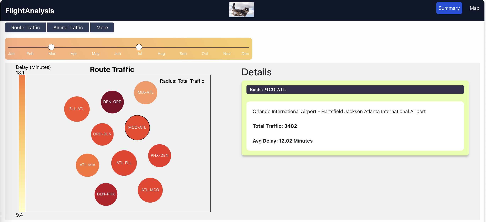
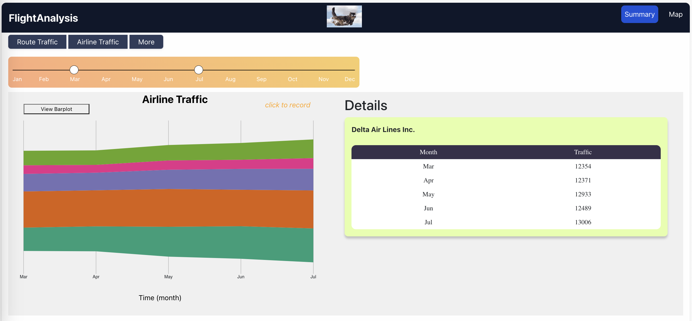

# US Airline Visualizaiton

US 2021 airline traffic visualizaiton project.

*Simon Fraser University, CMPT 767 Data Visualization, Fall 2023*

## How to run

> node version: v20.8.0

```bash
npm install
npm start
```

## Page 1 (Home): Flight Visualization on US Map

This page shows a US Map view of our data. We prepared a US map to show the flights on it. In addition to the slider we mentioned before, we also provide a dropdown menu for selecting the number of top flights to display. The flight paths displayed on the map vary in thickness based on different flight volumes, and they have different colors depending on whether the flight is outbound or inbound.


## Page 2 (Summary): Flight Statistics by Route and Airline

The initial view we incorporated is the Bubble Chart. Positioned at the top of this view is a slider, allowing users to select a specific time period for data filtering. Directly below, the primary graph unfolds, featuring bubbles within the main canvas, each adorned with text denoting the corresponding route. These bubbles are distinguished by varying colors, with the intensity of the color indicating the minutes of delay on the respective route.

The second view is a stream graph that illustrates a comparison of flight volumes among the top five airlines in the US. 

 

*Route Traffic - Map View*


*Route Traffic - Bubble Chart*


*Airline Traffic - Bar Chart*


*Airline Traffic - Stream Chart*